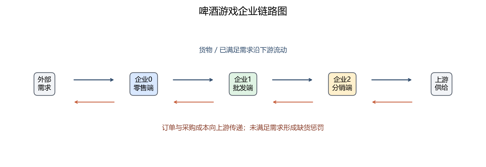
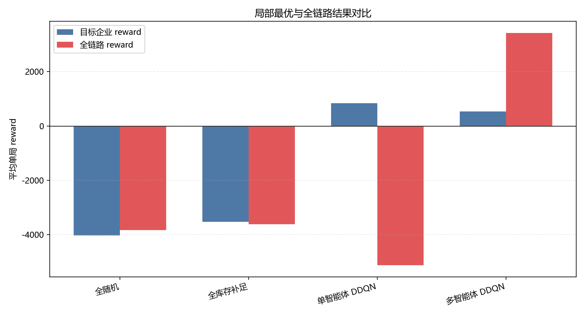
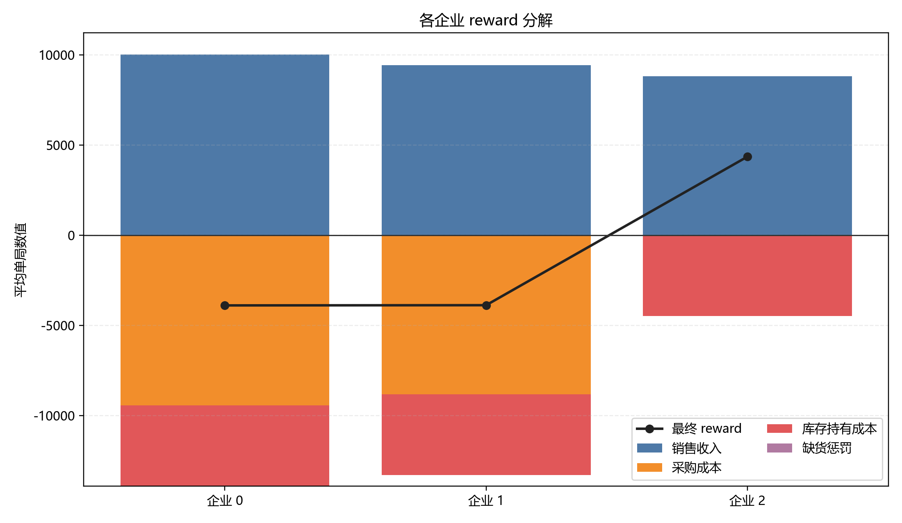
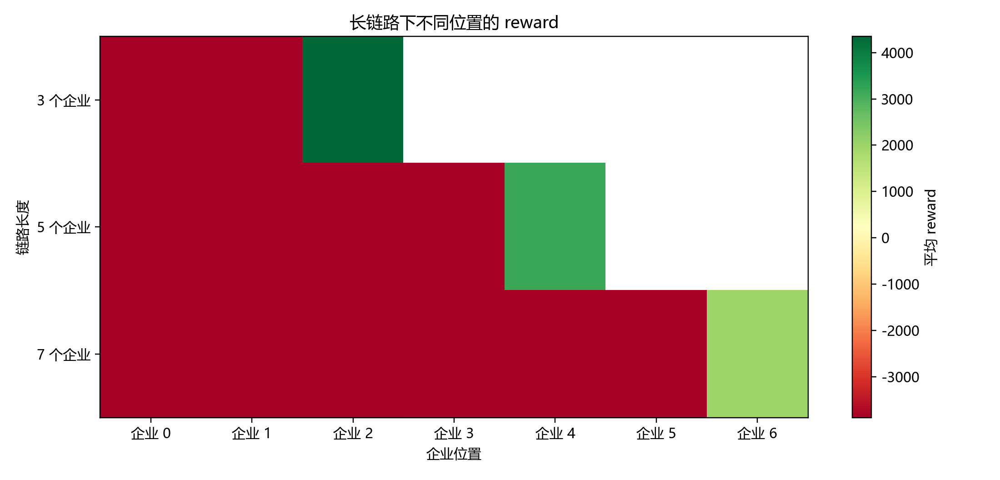
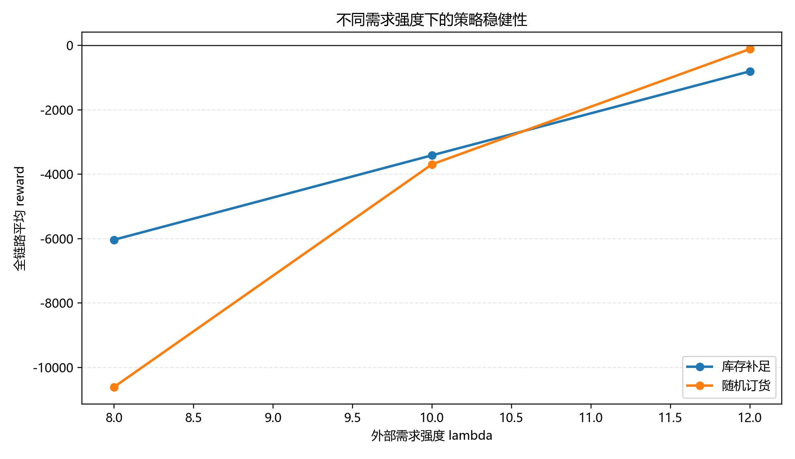
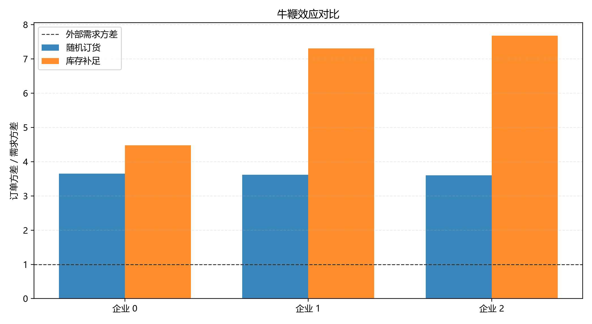

# Beer Game Decision Lab

一个把经典 Beer Game 供应链任务做成产品/研究原型的实验项目。项目不只比较 DQN、Double DQN、Dueling DQN、PPO 的算法分数，而是围绕一个更产品化的问题展开：

> 在多主体供应链里，为什么局部最优可能伤害全链路？系统应该如何把这种权衡解释清楚？

当前版本保留原有算法实验，并新增产品分析层：企业链路图、长链路压力测试、reward 分解、需求鲁棒性、bullwhip 指标和局部/全局收益对比。

## Problem

Beer Game 模拟一个串行供应链。每个企业只能看到自己的局部状态，并决定本期订货量。订单和货物流动存在 `t+1` 延迟，因此局部决策会通过库存、缺货和采购成本传导到其他企业。

这个项目关注三个问题：

- 单个智能体学到高 reward 后，为什么全链路 reward 仍可能变差？
- 链路从 3 个企业拉长到 5、7 个企业后，收益和波动如何变化？
- 面向产品或运营决策系统时，哪些指标比单一 reward 更能解释策略质量？

## System Model

默认链路为：

```text
External demand -> Firm 0 -> Firm 1 -> Firm 2 -> Upstream supply
```

货物流向下游移动，订单和采购成本向上游移动。每个企业的单步 reward 由利润式指标计算：

```text
reward = revenue - purchase_cost - holding_cost - lost_sales_penalty
```

其中：

```text
revenue = price_i * satisfied_demand_i
purchase_cost = price_{i+1} * order_i
holding_cost = holding_cost_rate * inventory_i
lost_sales_penalty = lost_sales_cost * stockout_i
```

最后一个企业没有更上游采购成本，因此天然更容易出现 reward 分布不均。新增的 `info["reward_components"]` 会记录每个企业的收入、采购成本、库存成本、缺货惩罚和最终 reward，用于解释这种不均衡。



## Agent Design

已实现的方法包括：

- Rule baselines: `random`, `base_stock`
- Value-based RL: `dqn`, `double_dqn`, `dueling_dqn`, `dueling_double_dqn`
- Policy gradient baseline: `ppo`
- Background policy experiments: random background vs base-stock background
- Multi-agent experiment: independent Dueling Double DQN agents for all firms

原有智能体观察仍保持课程设定的 3 维局部状态：

```text
[last_order, last_satisfied_demand, current_inventory]
```

产品分析层不会改变智能体可见状态，只在环境 `info` 中增加分析字段，避免破坏已有训练结果的可比性。

## Experiments

### 1. Algorithm baseline

默认配置中，目标企业为 `firm_id = 1`，每个算法在 3 个 seed 上训练并评估。

| Method | Mean reward | Std |
| --- | ---: | ---: |
| `random` | -3435.22 | 2511.29 |
| `base_stock` | -3885.23 | 824.78 |
| `dqn` | 753.54 | 117.23 |
| `double_dqn` | 794.83 | 110.81 |
| `dueling_dqn` | 765.61 | 131.08 |
| `dueling_double_dqn` | 809.33 | 128.92 |
| `ppo` | 823.22 | 121.34 |


### 2. Local optimum vs chain outcome

多智能体实验同时统计每个企业 reward 与全链路 total reward：

| Method | Firm 0 | Firm 1 | Firm 2 | Total chain |
| --- | ---: | ---: | ---: | ---: |
| `random_all` | -3763.38 | -4023.73 | 3957.10 | -3830.00 |
| `base_stock_all` | -3509.93 | -3521.32 | 3414.05 | -3617.20 |
| `single_agent_ddqn` | -2552.45 | 838.55 | -3408.35 | -5122.25 |
| `multiagent_ddqn` | 468.77 | 538.60 | 2419.18 | 3426.55 |

关键现象：`single_agent_ddqn` 能显著提高目标企业 1 的收益，但全链路仍为负；`multiagent_ddqn` 的企业 1 局部 reward 反而低一些，但全链路 total reward 转正。这是本项目最适合作品集展示的洞察：局部最优和系统最优不是同一个目标。



### 3. Reward imbalance analysis

默认 3 企业、`lambda=10`、base-stock 策略下，reward 分解显示：

| Firm | Revenue | Purchase cost | Holding cost | Stockout penalty | Final reward |
| --- | ---: | ---: | ---: | ---: | ---: |
| Firm 0 | 10023.50 | 9422.25 | 4490.09 | 0.00 | -3888.84 |
| Firm 1 | 9422.25 | 8820.09 | 4478.87 | 0.00 | -3876.71 |
| Firm 2 | 8820.09 | 0.00 | 4467.20 | 0.00 | 4352.89 |

这里的 reward 不均主要来自链路位置：下游企业既要承担采购成本，也要承担库存成本；最上游企业没有采购成本，因此 reward 更高。这个结果说明，评估多主体系统时不能只看单个企业的 reward，需要看成本项和链路总收益。



### 4. Longer-chain stress test

产品分析脚本会在 3、5、7 个企业的链路上复用同一套规则策略，观察链路拉长后的系统压力。

| Policy | Chain length | Total chain reward | Reward imbalance index |
| --- | ---: | ---: | ---: |
| `random` | 3 | -3693.42 | 0.948 |
| `base_stock` | 3 | -3412.66 | 0.961 |
| `random` | 5 | -12937.95 | 0.732 |
| `base_stock` | 5 | -12314.28 | 0.755 |
| `random` | 7 | -22413.03 | 0.532 |
| `base_stock` | 7 | -21176.63 | 0.570 |

链路越长，总收益压力越明显。这个实验不追求训练出最优长链路智能体，而是先证明：当企业数量增加，延迟、库存和订单波动会累积，系统需要更强的协调指标。



### 5. Demand robustness and bullwhip

在不同外部需求强度下，项目会比较 total chain reward、服务水平、缺货率和订单波动。



Bullwhip ratio 用于观察订单方差相对外部需求方差的放大程度：

```text
bullwhip_ratio_i = variance(order_i) / variance(external_demand)
```



## Product Implications

这个原型更像一个供应链决策解释工具，而不只是算法作业：

- 决策系统需要同时展示局部收益和全局收益，否则会鼓励单点最优。
- reward 应拆成收入、采购、库存、缺货四类成本，才能解释“为什么某个企业看起来吃亏”。
- 链路越长，单一规则策略越难保持稳定，需要引入协同训练、系统 reward 或约束式优化。
- 面向业务使用时，service level、stockout rate、inventory、bullwhip ratio 比单一 reward 更容易被运营人员理解。

## Run

安装依赖：

```bash
pip install -r requirements.txt
```

运行原有算法 baseline：

```bash
python -m beergame.run_baselines --config configs/default.json
```

跳过已有模型训练，只重新评估：

```bash
python -m beergame.run_baselines --config configs/default.json --skip-train
```

运行背景策略实验：

```bash
python -m beergame.run_background_experiments --config configs/default.json
```

运行多智能体实验：

```bash
python -m beergame.run_multiagent --config configs/default.json
```

生成产品化分析数据与图表：

```bash
python -m beergame.run_product_analysis --config configs/default.json
```

## Outputs

产品化分析输出：

```text
results/product/chain_length_summary.json
results/product/reward_decomposition.json
results/product/demand_robustness_summary.json
results/product/policy_metrics_summary.json

figures/product/chain_map.png
figures/product/reward_decomposition.png
figures/product/chain_length_heatmap.png
figures/product/demand_robustness.png
figures/product/bullwhip_comparison.png
figures/product/local_global_tradeoff.png
```

原有算法输出：

```text
results/baselines/
results/background/
results/multiagent/

figures/baselines/
figures/background/
figures/multiagent/

models/baselines/
models/background/
models/multiagent/
```

## Key Findings

- PPO 与 Dueling Double DQN 在单目标企业任务上表现稳定，但这只能说明局部策略质量。
- 单智能体 DDQN 可以把企业 1 的 reward 提升到正值，却让全链路 total reward 更差。
- 多智能体 DDQN 显著改善全链路收益，说明供应链任务更适合系统级目标和协同指标。
- reward 不均不是简单的算法失败，而是供应链利润结构、采购成本位置和库存成本共同造成的。
- 更长链路下，总收益快速恶化，产品层必须让用户看到链路位置、成本项和波动来源。

## Limitations

- 长链路实验目前先使用规则策略做压力测试，没有重新训练 5、7 节点多智能体模型。
- 当前观察仍是 3 维局部状态，未把 pipeline 或 backorder 作为智能体输入。
- reward 设计仍以利润为主，尚未加入公平性约束、服务等级协议或真实企业成本函数。
- 当前项目是离线实验原型，还不是可交互仿真产品。

## Next Steps

- 在 5、7 节点链路上训练 multi-agent DDQN，对比规则策略压力测试。
- 增加 system reward、relative reward 或 externality penalty，验证能否减少局部/全局目标冲突。
- 把 `reward_components` 和 bullwhip 指标做成交互式 dashboard。
- 将本项目整理成个人作品集中的 case study，突出“产品问题 -> 系统建模 -> 算法实验 -> 指标解释”的完整链路。
