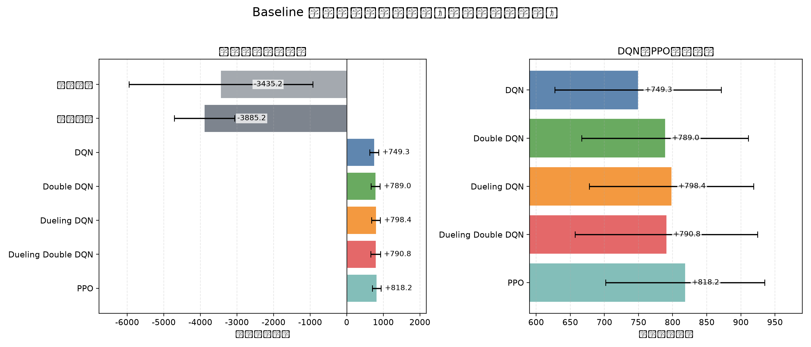
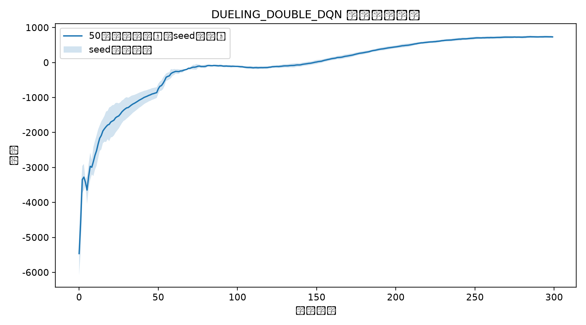
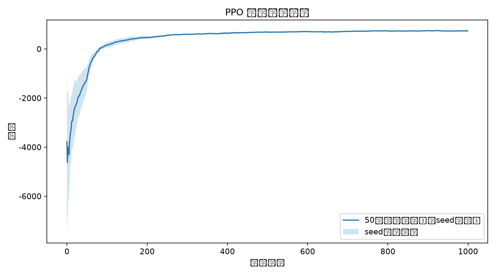
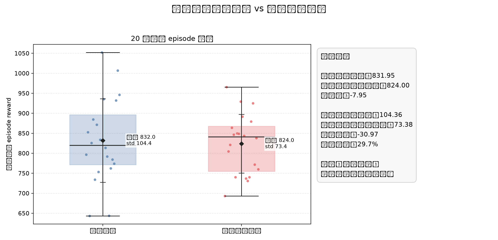
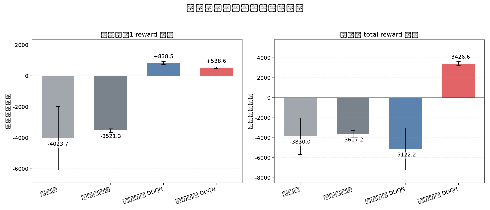
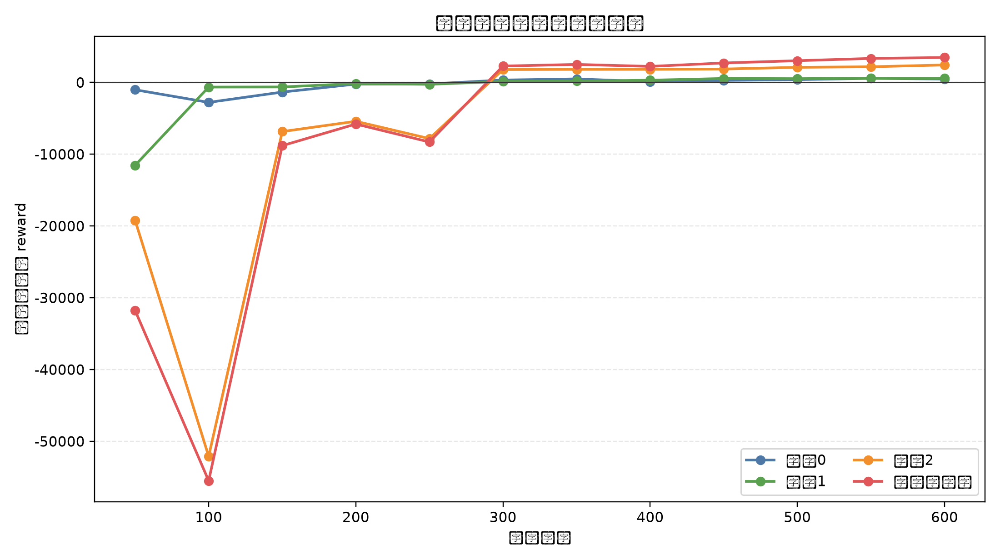

# 啤酒游戏 Baseline 与算法消融实验

本项目基于课程提供的 Beergame 供应链任务，整理了带有 `t+1` 到货延迟的实验环境，并实现了 DQN 系列算法消融实验。

## 任务设定

供应链包含 3 个串行企业：

```text
外部顾客 -> 企业0 -> 企业1 -> 企业2
```

当前实验固定优化第 2 个企业：

```text
firm_id = 1
```

每个企业使用课程原始 3 维局部观测：

```text
[上一期订货量, 上一期满足需求量, 当前库存]
```

本项目不加入 `pipeline` 观测，保证本轮实验只比较算法和背景策略差异。

## 环境机制

本项目实现了 `t+1` 到货机制：

```text
t 时刻发出的订单不会立刻进入库存
t+1 时刻才会作为在途货物到达
```

每个企业的单步 reward 按当期利润计算：

```text
reward = 销售收入 - 采购成本 - 库存持有成本 - 缺货惩罚
```

对应公式：

```text
p_i * satisfied_demand_i
- p_{i+1} * order_i
- h * inventory_i
- c * lost_sales_i
```

最后一个企业没有更上游供应商，因此采购成本项为 0。

## 已实现方法

规则 baseline：

- `random`：随机订货。
- `base_stock`：库存补足策略，即根据当前库存补到目标库存水位。

DQN 系列算法消融：

- `dqn`：普通 DQN。
- `double_dqn`：使用在线网络选动作、目标网络估值，缓解 Q 值高估。
- `dueling_dqn`：使用 `V(s) + A(s,a)` 分解的 Dueling 网络。
- `dueling_double_dqn`：同时使用 Double DQN 目标和 Dueling 网络。

PPO 基线：

- `ppo`：离散动作 Actor-Critic PPO，使用 PPO-Clip 目标、GAE 优势估计、状态/奖励归一化与最优检查点选择。

背景策略实验：

- `random_background`：除目标企业外，其他企业随机订货。
- `base_stock_background`：除目标企业外，其他企业使用库存补足策略。

背景策略实验用于回答：目标企业的学习效果在“随机上下游”和“规则化上下游”中有什么差异。

## 代码结构

```text
beergame/
  env.py                     # Beergame环境与t+1到货逻辑
  policies.py                # random和base_stock规则策略
  dqn.py                     # DQN、Double DQN、Dueling DQN实现
  ppo.py                     # 离散动作PPO实现
  experiments.py             # 训练、评估、画图工具函数
  run_baselines.py           # 一键运行baseline与算法消融
  run_background_experiments.py # 其他企业随机/库存补足背景对比
  run_multiagent.py          # 三个企业独立Dueling Double DQN训练
  plot_policy_behavior.py    # 最终策略订购行为对比画图

configs/
  default.json               # 环境、算法和训练配置
```

## 环境安装

```bash
cd /path/to/beergame-dqn
pip install -r requirements.txt
```

或直接使用 `uv`：

```bash
uv run --with torch --with numpy --with matplotlib --index-url https://pypi.tuna.tsinghua.edu.cn/simple python -m beergame.run_baselines --config configs/default.json
```

## 运行方式

训练并评估全部 baseline 与算法消融：

```bash
cd /path/to/beergame-dqn
python -m beergame.run_baselines --config configs/default.json
```

如果已有模型，只想跳过已存在模型的训练并重新评估：

```bash
python -m beergame.run_baselines --config configs/default.json --skip-train
```

只训练/评估某个或某几个算法（例如只更新 PPO）：

```bash
python -m beergame.run_baselines --config configs/default.json --only ppo
```

`--only` 接受逗号分隔的算法名，如 `ppo,dueling_double_dqn`。

运行其他企业背景策略对比实验：

```bash
python -m beergame.run_background_experiments --config configs/default.json
```

该实验会分别训练两个 `Dueling Double DQN`：

- 一个在其他企业随机订货的背景下训练。
- 一个在其他企业库存补足的背景下训练。

两个模型互不覆盖，单独保存到 `models/background/`。

运行多智能体实验：

```bash
python -m beergame.run_multiagent --config configs/default.json
```

绘制最终策略订购行为对比：

```bash
python -m beergame.plot_policy_behavior --config configs/default.json --seed 123
```

输出到 `figures/policy_behavior/behavior_comparison.png`。

该实验采用 Independent Dueling Double DQN：

```text
企业0 -> agent_0
企业1 -> agent_1
企业2 -> agent_2
```

每个企业都有独立网络、经验池和模型文件。每一步三个 agent 同时根据自己的 3 维局部观测下单，环境统一执行动作向量。

如果已有多智能体模型，只想重新评估和重画图：

```bash
python -m beergame.run_multiagent --config configs/default.json --skip-train
```

## 当前算法消融结果

当前配置下，每个算法在 3 个 seed（`[42, 123, 456]`）上各训练、评估 20 个 episode，共 60 个评估 episode。DQN 系列训练 300 个 episode，PPO 训练 1000 个 episode。结果如下：

| 方法 | 平均 reward | 标准差 | seed 均值 |
| --- | ---: | ---: | --- |
| `random` | -3435.22 | 2511.29 | -2659.18 / -4013.85 / -3632.62 |
| `base_stock` | -3885.23 | 824.78 | -3979.18 / -3787.88 / -3888.65 |
| `dqn` | 760.93 | 109.97 | 789.95 / 744.67 / 748.17 |
| `double_dqn` | 797.19 | 117.85 | 813.00 / 777.22 / 801.35 |
| `dueling_dqn` | 781.23 | 126.05 | 792.53 / 762.03 / 789.15 |
| `dueling_double_dqn` | 804.46 | 114.58 | 838.55 / 787.10 / 787.72 |
| `ppo` | **822.92** | 116.89 | 820.10 / 799.45 / 849.22 |

训练曲线会画出 seed 间均值与标准差带。

**结果分析**：

- PPO 在引入 state/reward normalization、best-checkpoint selection、并调大学习率与 rollout 批次后，3-seed 平均奖励达到 **822.92**，稳定超过此前最优的 `Dueling Double DQN`（**804.46**）。
- DQN 系列仍然表现稳健，`Dueling Double DQN` 平均奖励为 **804.46**，是可靠的值函数方法 baseline。

关键改进说明：

- `use_state_norm` 与 `use_reward_norm`：对局部观测和单步奖励做 online running mean/std 归一化，降低不同 seed 下初始分布差异带来的训练震荡。
- `train_ppo_best`：训练过程中每 `eval_every` 轮用当前策略在独立评估集上测试，保存并恢复最优 checkpoint，避免 PPO 后期策略退化导致的最终性能下降。
- 超参数调整：`learning_rate=3e-4`、`rollout_episodes=8`、`update_epochs=10`，在更大批量梯度的同时减少每次更新的过拟合风险。



完整结果保存在：

```text
results/baselines/baseline_summary.json
figures/baselines/baseline_comparison.png
```

以 Dueling Double DQN 和 PPO 为例的训练曲线：





## 最终策略订购行为对比

运行 `plot_policy_behavior` 可以在同一个 episode 中对比不同策略的订货量、库存、需求和即时奖励：

```bash
python -m beergame.plot_policy_behavior --config configs/default.json --seed 123
```

输出：

```text
figures/policy_behavior/behavior_comparison.png
figures/policy_behavior/behavior_records.json
```


## 背景策略对比结果

当前 seed=42、每种背景训练 300 个 episode、评估 20 个 episode 的结果如下：

| 背景策略 | 平均 reward | 标准差 |
| --- | ---: | ---: |
| `random_background` | 831.95 | 104.36 |
| `base_stock_background` | 824.00 | 73.38 |

在该结果下，两种背景的平均 reward 接近；`base_stock_background` 的标准差更低，说明规则化上下游背景下评估波动更小。

背景策略实验会输出：

```text
results/background/background_policy_summary.json
figures/background/background_policy_comparison.png
```



训练曲线保存为：

```text
figures/background/dueling_double_dqn_random_background_training_rewards.png
figures/background/dueling_double_dqn_base_stock_background_training_rewards.png
```

模型保存为：

```text
models/background/dueling_double_dqn_random_background_seed_42_firm_1_tplus1.pt
models/background/dueling_double_dqn_base_stock_background_seed_42_firm_1_tplus1.pt
```

## 多智能体实验结果

多智能体实验同时统计每个企业的 reward 和全链路 total reward：

```text
total_chain_reward = firm_0_reward + firm_1_reward + firm_2_reward
```

对比对象包括：

- `random_all`：所有企业随机订货。
- `base_stock_all`：所有企业库存补足。
- `single_agent_ddqn`：只训练企业1，其余企业随机。
- `multiagent_ddqn`：三个企业都使用独立 Dueling Double DQN。

当前 seed=42、训练 600 个 episode、评估 20 个 episode 的结果如下：

| 方法 | 企业0 reward | 企业1 reward | 企业2 reward | 全链路 total reward |
| --- | ---: | ---: | ---: | ---: |
| `random_all` | -3763.38 | -4023.73 | 3957.10 | -3830.00 |
| `base_stock_all` | -3509.93 | -3521.32 | 3414.05 | -3617.20 |
| `single_agent_ddqn` | -3057.18 | 831.95 | -2438.50 | -4663.73 |
| `multiagent_ddqn` | 468.77 | 538.60 | 2419.18 | 3426.55 |

该结果说明：单智能体 DDQN 能显著提高目标企业1的局部收益，但全链路收益仍为负；多智能体 DDQN 的企业1局部收益较低，但三个企业共同学习后，全链路 total reward 明显提升为正。

多智能体输出文件：

```text
models/multiagent/dueling_double_dqn_firm_0_seed_42_tplus1.pt
models/multiagent/dueling_double_dqn_firm_1_seed_42_tplus1.pt
models/multiagent/dueling_double_dqn_firm_2_seed_42_tplus1.pt
results/multiagent/multiagent_training_scores.npy
results/multiagent/multiagent_eval_points.npy
results/multiagent/multiagent_eval_scores.npy
results/multiagent/multiagent_summary.json
figures/multiagent/multiagent_training_rewards.png
figures/multiagent/multiagent_eval_curve.png
figures/multiagent/multiagent_comparison.png
```

其中 `multiagent_eval_curve.png` 是每 50 轮进行一次无探索评估得到的曲线，包含企业0、企业1、企业2和全链路 total reward。它比训练 reward 曲线更适合判断“当前学到的最终策略是否变好”。





## 输出文件

算法消融模型：

```text
models/baselines/{algorithm}_seed_{seed}_firm_1_tplus1.pt
```

算法消融训练奖励：

```text
results/baselines/{algorithm}_seed_{seed}_training_scores.npy
results/baselines/{algorithm}_training_scores.npy
figures/baselines/{algorithm}_training_rewards.png
```

背景策略实验输出：

```text
models/background/
results/background/
figures/background/
```

最终策略订购行为输出：

```text
figures/policy_behavior/behavior_comparison.png
figures/policy_behavior/behavior_records.json
```

多智能体实验输出：

```text
models/multiagent/
results/multiagent/
figures/multiagent/
```

## 快速检查

```bash
python -m py_compile beergame/dqn.py beergame/experiments.py beergame/run_baselines.py beergame/run_background_experiments.py beergame/run_multiagent.py beergame/plot_policy_behavior.py
python -m beergame.run_baselines --config configs/default.json --skip-train
python -m beergame.run_background_experiments --config configs/default.json
python -m beergame.run_multiagent --config configs/default.json
python -m beergame.plot_policy_behavior --config configs/default.json
```
